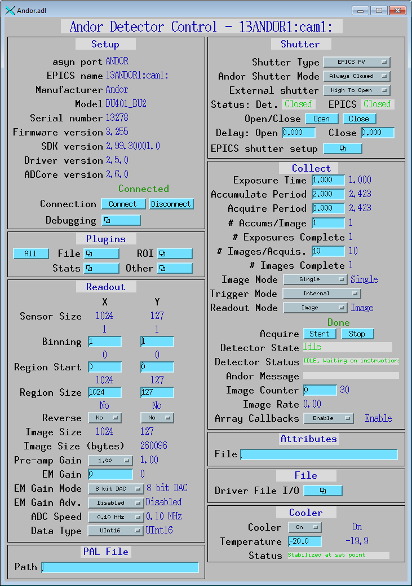

areaDetector Andor driver
=========================

:author: Matthew Pearson, Oak Ridge National Laboratory and
         Mark Rivers, University of Chicago

.. contents:: Contents

Introduction
------------

This is an :doc:`../index` driver for CCD detectors from
`Andor Technology <http://www.andor.com>`__ using Version 2 of the Andor
Software Development Kit (SDK). It has been tested on the Andor iKon and
DU401 CCD cameras with USB interface, but should work with other cameras
as well. The driver is supported on 32-bit and 64- bit Linux and 32-bit
and 64-bit Windows.

The driver currently provides access to most of the features of the
Andor cameras:

-  All Andor acquisition modes (Single Scan, Accumulate, Kinetics, Run
   Till Abort, and Fast Kinetics
-  Control of the exposure time, accumulate cycle time, and kinetic
   cycle time
-  Support for all of the Andor trigger modes
-  Support for all of the Andor shutter modes
-  Support for reading the detectors with 16-bit or 32-bit depth
-  Saving files using the Andor SDK and/or with the standard
   areaDetector plugins
-  Change the ADC sampling speed (0.05MHz and 2.5MHz on the iKon) and
   the Vertical Shift Period
-  Set a region of interest (a smaller region can be read out faster)
-  Set and monitor the CCD temperature
-  Electron Multiplying (EM) Gain on supported detectors
-  Support for selecting between Full Vertical Binning (FVB) and Image
   readout modes
-  Support for Frame Transfer mode

The Andor module includes a separate driver to control the Andor
Shamrock spectrographs. If the detector data is saved in the Princeton
Instruments SPE file format using the Andor driver then it will include
the Shamrock wavelength calibration information. No other file formats
support saving the calibration.

This driver inherits from :doc:`../ADCore/ADDriver`
It implements many of the parameters in
`asynNDArrayDriver.h <../areaDetectorDoxygenHTML/asyn_n_d_array_driver_8h.html>`__
and in
`ADArrayDriver.h <../areaDetectorDoxygenHTML/_a_d_driver_8h.html>`__. It
also implements a number of parameters that are specific to the Andor
detectors. The `Andor class
documentation <../areaDetectorDoxygenHTML/class_andor_c_c_d.html>`__
describes this class in detail.

This document does not attempt to explain the meaning of the
Andor-specific parameters. The Andor Software Development Kit
documentation provides this detailed information. Andor does not allow
me to redistribute the SDK documentation as part of areaDetector. It
must be obtained from `Andor's Web
site <http://www.andor.com/scientific-software/software-development-kit/andor-sdk>`__.

areaDetector includes the header and library files required to build the
andor driver on any Linux or Windows computer. However, it does not
include the shareable libraries, DLLs or drivers to actually run a
detector. Those must be obtained from Andor, either by purchasing their
SDK or their Solis application software. On Windows the path to the
directory containing the Andor DLLs from the SDK or Solis must be added
to the PATH environment variable when running the areaDetector IOC. On
Linux the path to the directory containing the Andor shareable libraries
from the SDK must be added to the LD_LIBRARY_PATH environment variable
when running the areaDetector IOC.

NOTE: When using the Shamrock spectrograph on Windows the following DLLs
must actually be copied from the SDK directory to the current working
directory from which the IOC application is being run, e.g.
iocBoot/iocAndor.

-  atmcd32d.dll
-  ShamrockCIF.dll
-  atshamrock.dll

This is a rather strange requirement of the Andor Shamrock SDK, which
will hopefully be fixed by them in a future release.

.. note:: When using SDK version >= 2.102.30000.0 on Linux one must make
          sure that libUSBI2C-[ARCH].so.[VERSION] is installed as part of support
          into libUSBI2C.so and libUSBI2C.so.2.

Also `libd2xx_table.so` might be needed to get Shamrock communicating. See
`andorSupport/ftdi_table.c` for more.

Compile with:

::

       $ gcc -fpic -shared -Wl,-soname,libd2xx_table.so -o libd2xx_table.so ftdi_table.c
     

Place the `libd2xx_table.so` into the folder with the rest of SDK support
libraries.

Implementation of standard driver parameters
--------------------------------------------

The following table describes how the Andor driver implements some of
the standard driver parameters.

.. |br| raw:: html

     

.. cssclass:: table-bordered table-striped table-hover
.. flat-table::
  :header-rows: 2
  :widths: 10 10 80

  * - Implementation of Parameters in asynNDArrayDriver.h and ADDriver.h, and EPICS Record
      Definitions in ADBase.template and NDFile.template
  * - Parameter index variable
    - EPICS record name
    - Description
  * - ADTriggerMode
    - $(P)$(R)TriggerMode, $(P)$(R)TriggerMode_RBV
    - Sets the trigger mode for the detector. Options are: |br|
      Internal |br|
      External |br|
      External Start |br|
      External Exposure |br|
      External FVP |br|
      Software |br|
  * - ADImageMode
    - $(P)$(R)ImageMode, $(P)$(R)ImageMode_RBV
    - Sets the image mode for the detector. Options are: |br|
      Single |br|
      Multiple |br|
      Continuous |br|
      Fast Kinetics |br|
      The relation of ImageMode to the Andor acquisition modes are given in the table
      below.
  * - ADNumExposures
    - $(P)$(R)NumExposures, $(P)$(R)NumExposures_RBV
    - Sets the number of accumulations (performed in software in Andor's driver) in Single
      and Multiple modes
  * - ADNumImages
    - $(P)$(R)NumImages, $(P)$(R)NumImages_RBV
    - Sets the number of images to take in multiple (Kinetics Series) mode
  * - ADAcquirePeriod
    - $(P)$(R)AcquirePeriod, $(P)$(R)AcquirePeriod_RBV
    - Sets the time between images in Multiple (Kinetics Series) and Continuous (Run Till
      Abort) modes
  * - ADGain
    - $(P)$(R)Gain, $(P)$(R)Gain_RBV
    - Sets the pre-amp gain of the detector. For the Andor driver the Gain is treated
      as an integer index into the supported gain table of the specific detector. The
      list of supported gains for the detector gain be found by typing "asynReport 1,ANDOR"
      at the IOC prompt. For example, on the iKon-M the relationship is: |br|
      Gain=0 Andor gain=1.0 |br|
      Gain=1 Andor gain=2.0 |br|
      Gain=2 Andor gain=4.0 |br|
  * - NDDataType
    - $(P)$(R)DataType, $(P)$(R)DataType_RBV
    - Sets data type for reading out the detector. Allowed values are: |br|
      UInt16 |br|
      UInt32 |br|
      UInt16 can be used when reading out a 16-bit detector with NumExposures=1, (i.e.
      without accumulations), or when one can be sure that multiple accumulations will
      not overflow 16 bits. UInt32 should be used for 32-bit detectors or when multiple
      accumulations could cause 16-bit overflow.
  * - ADTemperature
    - $(P)$(R)Temperature, $(P)$(R)Temperature_RBV
    - Sets the setpoint temperature of the CCD (-120C to 20C)
  * - ADTemperatureActual
    - $(P)$(R)TemperatureActual
    - Reads the actual temperature of the CCD
  * - NDFileFormat
    - $(P)$(R)FileFormat, $(P)$(R)FileFormat_RBV
    - Selects the file format for saving files with the Andor driver. Choices are: |br|
      TIFF |br|
      BMP |br|
      SIF |br|
      EDF |br|
      RAW |br|
      FITS |br|
      SPE |br|
      All of the file formats except SPE are written by the Andor SDK. The SPE file format
      is written directly by the driver. It uses version 3.0 of the SPE format, which
      includes XML metadata after the image data. Only the SPE format is able to save
      the wavelength calibration from the Shamrock spectrographs.

The following table shows the relationship of ImageMode to the Andor acquisition
modes, and the meaning of NumExposures and NumImages.

.. cssclass:: table-bordered table-striped table-hover
.. flat-table::
  :header-rows: 2
  :widths: 10 15 15 15 15 15 15

  * -
    -
    - Relationship of ImageMode to the Andor acquisition modes, and the meaning of NumExposures
      and NumImages.
  * - ImageMode
    - NumExposures
    - AcquireTime
    - AndorAccumulatePeriod
    - NumImages
    - AcquirePeriod
    - Andor acquisition mode
  * - Single
    - 1
    - Sets exposure time
    - Not applicable
    - Not applicable
    - Not applicable
    - Single Scan
  * - Single
    - >1 Sets number of accumulations per image.
    - Sets exposure time per accumulation
    - Sets accumulation period (cycle time)
    - Not applicable
    - Not applicable
    - Accumulate
  * - Multiple
    - Sets number of accumulations per image
    - Sets exposure time per accumulation
    - Sets accumulation period if NumExposures > 1
    - Sets number of images
    - Sets time between images (cycle time)
    - Kinetic Series
  * - Continuous
    - Not applicable
    - Sets exposure time per image
    - Not applicable
    - Not applicable
    - Sets time between images (cycle time)
    - Run Till Abort
  * - Fast Kinetics
    - Not applicable
    - Sets exposure time per sub-area
    - Not applicable
    - Controls number of sub-area exposures, each being followed by a vertical shift of
      SizeY. MinY controls the offset of the first row from the bottom of the CCD. SizeY
      controls the sub-area height. BinX and BinY control the horizontal and vertical
      binning.
    - Not applicable
    - Fast Kinetics

Andor specific parameters
-------------------------

The Andor driver implements the following parameters in addition to
those in asynNDArrayDriver.h and ADDriver.h.

.. cssclass:: table-bordered table-striped table-hover
.. flat-table::
  :header-rows: 2
  :widths: 5 5 5 70 5 5 5

  * -
    -
    - Parameter Definitions in andorCCD.h and EPICS Record Definitions in andorCCD.template
  * - Parameter index variable
    - asyn interface
    - Access
    - Description
    - drvInfo string
    - EPICS record name
    - EPICS record type
  * - AndorCoolerParam
    - asynInt32
    - R/W
    - Turn the CCD cooler on and off
    - ANDOR_COOLER
    - AndorCooler, AndorCooler_RBV
    - bo, bi
  * - AndorTempStatusMessage
    - asynOctet
    - R/O
    - Temperature status message.
    - ANDOR_TEMP_STAT
    - AndorTempStatus_RBV
    - waveform
  * - AndorMessage
    - asynOctet
    - R/O
    - Other status message.
    - ANDOR_MESSAGE
    - AndorMessage_RBV
    - waveform
  * - AndorShutterMode
    - asynInt32
    - R/W
    - Selects the Andor shutter mode. Choices are: |br|
      Full Auto |br|
      Always Open |br|
      Always Closed |br|
      Open for FVB |br|
      Open for Any |br|
    - ANDOR_SHUTTER_MODE
    - AndorShutterMode
    - mbbo
  * - AndorShutterExTTL
    - asynInt32
    - R/W
    - Selects the TTL polarity of an external shutter. Choices are: |br|
      Low To Open |br|
      High To Open |br|
    - ANDOR_SHUTTER_EXTTL
    - AndorShutterExTTL
    - bo
  * - AndorPALFileName
    - asynOctet
    - R/W
    - Path and Filename of pallette file (used for TIFF and BMP file colours) (255 chars
      max).
    - ANDOR_PAL_FILE_PATH
    - PALFilePath
    - waveform
  * - AndorAdcSpeed
    - asynInt32
    - R/W
    - Switch between the slow (low noise) ADC and the fast ADC. Choices are: |br|
      0.05 MHz |br|
      2.5 MHz |br|
    - ANDOR_ADC_SPEED
    - AndorADCSpeed, AndorADCSpeed_RBV
    - mbbo, mbbi
  * - AndorAccumulatePeriod
    - asynFloat64
    - R/W
    - Controls the period between accumulations when ImageMode=Single or Multiple and
      NumExposures&gt;1. NOTE: Some Andor detectors (including the iKon) only support
      a single period when doing multiple accumulations in kinetic series mode. For these
      cameras ANDOR_ACCUMULATE_PERIOD has no effect, ACQUIRE_PERIOD determines the time
      between accumulations, and the time between images is 0, i.e. the next image starts
      as soon as the previous one is complete.
    - ANDOR_ACCUMULATE_PERIOD
    - AndorAccumulatePeriod, AndorAccumulatePeriod_RBV
    - ao, ai
  * - AndorAccumulatePeriodActual
    - asynFloat64
    - R/O
    - Reads the actual value of AndorAccumulatePeriod, which may differ from the requested
      value due to timing limitations of the detector.
    - ANDOR_ACCUMULATE_PERIOD_ACTUAL
    - AndorAccumulatePeriodActual
    - ai
  * - AndorAcquireTimeActual
    - asynFloat64
    - R/O
    - Reads the actual value of ADAcquireTime, which may differ from the requested value
      due to timing limitations of the detector.
    - ANDOR_ACQUIRE_TIME_ACTUAL
    - AndorAcquireTimeActual
    - ai
  * - AndorAcquirePeriodActual
    - asynFloat64
    - R/O
    - Reads the actual value of ADAcquirePeriod, which may differ from the requested value
      due to timing limitations of the detector.
    - ANDOR_ACQUIRE_PERIOD_ACTUAL
    - AndorAcquirePeriodActual
    - ai
  * - AndorBaselineClamp
    - asynInt32
    - R/W
    - Enable or disable the baseline clamp option.
    - ANDOR_BASELINE_CLAMP
    - AndorBaselineClamp, AndorBaselineClamp_RBV
    - bo, bi
  * - AndorEMGain
    - asynInt32
    - R/W
    - Controls the Electron Multiplying (EM) Gain level on supported detectors. The valid
      range depends on the value of AndorEMGainMode and the detector temperature. For
      cameras that do not support EM Gain, AndorEMGain has no effect.
    - ANDOR_EM_GAIN
    - AndorEMGain, AndorEMGain_RBV
    - ao, ai
  * - AndorEMGainMode
    - asynInt32
    - R/W
    - Sets the EM Gain mode on supported detectors. Choices are: |br|
      8 bit DAC |br|
      12 bit DAC |br|
      Linear Mode |br|
      Real EM Gain |br|
      For cameras that do not support EM Gain, AndorEMGainMode has no effect.
    - ANDOR_EM_GAIN_MODE
    - AndorEMGainMode, AndorEMGainMode_RBV
    - mbbo, mbbi
  * - AndorEMGainAdvanced
    - asynInt32
    - R/W
    - Enables access to higher EM Gain levels. Choices are: |br|
      Disabled |br|
      Enabled |br|
      For cameras that do not support EM Gain, AndorEMGainAdvanced has no effect. NOTE:
      Before using higher levels, you should ensure that light levels do not exceed the
      regime of tens of photons per pixel, otherwise accelerated ageing of the sensor
      can occur.
    - ANDOR_EM_GAIN_ADVANCED
    - AndorEMGainAdvanced, AndorEMGainAdvanced_RBV
    - bo, bi
  * - AndorReadOutMode
    - asynInt32
    - R/W
    - Switch between the readout modes. Choices are: |br|
      Full Vertical Binning (FVB) |br|
      Image |br|
    - ANDOR_READOUT_MODE
    - AndorReadOutMode, AndorReadOutMode_RBV
    - mbbo, mbbi
  * - AndorFTMode
    - asynInt32
    - R/W
    - Set Frame Transfer mode. Choices are: |br|
      Disabled |br|
      Enabled |br|
      Note: Only available on supported CCDs.
    - ANDOR_FT_MODE
    - AndorFTMode, AndorFTMode_RBV
    - bo, bi
  * - AndorVSPeriod
    - asynInt32
    - R/W
    - Sets Vetical Shift Period, in units of microseconds per pixel shift. 
      Choices are constructed at runtime. For example, the choices for an iDus are: |hr|
      4.25 us |br|
      8.25 us |br|
      16.25 us |br|
      32.25 us |br|
      64.25 us |br|
    - ANDOR_VS_PERIOD
    - AndorVSPeriod, AndorVSPeriod_RBV
    - mbbo, mbbi
 

Unsupported standard driver parameters
--------------------------------------

ColorMode, ReverseX, and ReverseY are currently not supported.

Shamrock spectrograph control
-----------------------------

The Andor module also includes a driver for the Andor Shamrock
spectrographs. This driver allows control of the grating, central
wavelength, and slit sizes.

.. cssclass:: table-bordered table-striped table-hover
.. flat-table::
  :header-rows: 2
  :widths: 5 5 5 70 5 5 5

  * -
    -
    - Parameter Definitions in shamrock.cpp and EPICS Record Definitions in shamrock.template
  * - Parameter index variable
    - asyn interface
    - Access
    - Description
    - drvInfo string
    - EPICS record name
    - EPICS record type
  * - SRGrating
    - asynInt32
    - R/W
    - Selects the grating to use
    - SR_GRATING
    - Grating, Grating_RBV
    - mbbo, mbbi
  * - SRGratingExists
    - asynInt32
    - R/O
    - Flag indicating if a grating is present
    - SR_GRATING_EXISTS
    - GratingExists[N], N=1-3
    - bi
  * - SRWavelength
    - asynFloat64
    - R/W
    - Selects the central wavelength
    - SR_WAVELENGTH
    - Wavelength, Wavelength_RBV
    - ao, ai
  * - SRMinWavelength
    - asynFloat64
    - R/O
    - The minimum wavelength of the current configuration (ADDR=0) or the minimum wavelength
      of grating N (N=1-3)
    - SR_MIN_WAVELENGTH
    - MinWavelength, MinWavelength[N], N=1-3
    - ai
  * - SRMaxWavelength
    - asynFloat64
    - R/O
    - The maximum wavelength of the current configuration or the maximum wavelength of
      grating N (N=1-3)
    - SR_MAX_WAVELENGTH
    - MaxWavelength, MaxWavelength[N], N=1-3
    - ai
  * - SRSlitSize
    - asynFloat64
    - R/W
    - The size of slit N, N=1-4. The slits are numbered as follows: |br|
      1. Input slit side |br|
      2. Input slit direct |br|
      3. Output slit side |br|
      4. Output slit direct |br|
    - SR_SLIT_SIZE
    - SlitSize[N], N=1-4, SlitSize[N]_RBV
    - ao, ai
  * - SRSlitExists
    - asynInt32
    - R/O
    - Flag indicating if a slit is present
    - SR_SLIT_EXISTS
    - SlitExists[N], N=1-4
    - bi
  * - SRCalibration
    - asynFloat32Array
    - R/O
    - Array containing the wavelength calibration of each X pixel of the detector in nm.
    - SR_CALIBRATION
    - Calibration
    - bi

Usage
-----

Always use channel access put callback when setting parameters.

If any of the parameters set are out of range or fail in some way, then
the PV will be put into alarm state. This should be checked after every
PV set.

An example palette file for a TIFF file is GREY.PAL in the iocAndor
directory.

Configuration
-------------

The Andor driver is created with the andorCCDConfig command, either from
C/C++ or from the EPICS IOC shell.

::

   int andorCCDConfig(const char *portName,
                   int maxBuffers, size_t maxMemory,
                   const char* installPath,
                   int priority, int stackSize)
     

The Shamrock driver is created with the shamrockConfig command, either
from C/C++ or from the EPICS IOC shell.

::

   int shamrockConfig(const char *portName, 
                             int shamrockId, const char *iniPath, 
                             int priority, int stackSize)
     

For details on the meaning of the parameters to this function refer to
the detailed documentation on the andorCCDConfig function in the
`shamrock.cpp
documentation <../areaDetectorDoxygenHTML/shamrock_8cpp.html>`__ and in the
documentation for the constructor for the `shamrock
class <../areaDetectorDoxygenHTML/classshamrock.html>`__.

There an example IOC boot directory and startup script
:doc:`st_cmd` provided with
areaDetector.

MEDM screens
------------

The following shows the MEDM screen that is used to control the Andor
detector. Note that the general purpose screen ADBase.adl can be used,
but it exposes a few controls that are not applicable to the Andor, and
lacks some fields that are important for the Andor.

``Andor.adl`` is the main screen used to control the Andor driver.

The following shows the MEDM screen that is used to save files directly
with the Andor detector.

.. figure:: AndorFile.png
    :align: center

The following shows the MEDM screen that is used to control the Shamrock
spectrograph.

Restrictions
------------

The following are known restrictions of the Andor driver. These should
be fixed in a future release.

-  No support for detector output signals (trigger and gate).
-  Some Andor detectors (including the iKon) only support a single
   period when doing multiple accumulations in kinetic series mode. For
   these cameras ANDOR_ACCUMULATE_PERIOD has no effect, ACQUIRE_PERIOD
   determines the time between accumulations, and the time between
   images is 0, i.e. the next image starts as soon as the previous one
   is complete.
-  Saving files using the Andor driver in Multiple and Continuous modes
   results in errors because the Andor SDK functions won't save files if
   acquisition is in progress. Saving files in Single mode and Fast
   Kinetics mode works fine.
-  Trigger modes have not been tested.
-  The Shamrock wavelength calibration is only saved in SPE files. The
   Andor SDK file writers do not save the calibration, and it is not
   possible to pass the calibration to other file plugins as an
   attribute because array attributes are not currently supported in
   areaDetector.
-  Single-Track, Multi-Track and Random-Track readout modes are not yet
   supported.

